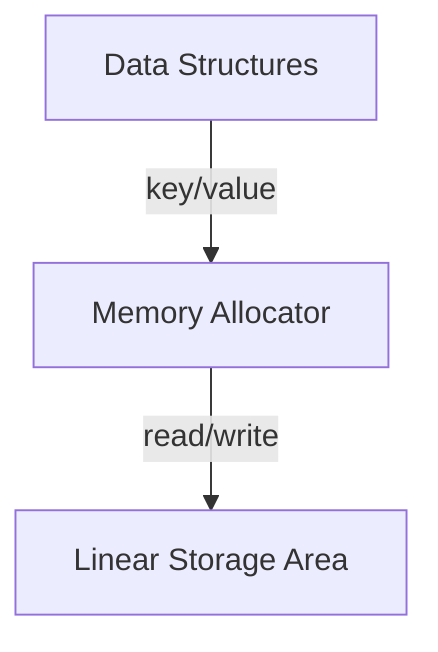

# Firewood

Firewood is an embedded key-value store, optimized to store blockchain state. 
It prioritizes access to latest state, by providing extremely fast reads, but also provides a limited view into past state. It does not copy-on-write like the EVM, but instead makes in-place changes to the state tree. This ensures that the database size is small and stable during the course of running firewood. Firewood exists to provide a very fast storage layer for [qEVM](https://github.com/ava-labs/qevm) to use in a custom subnet. 

Firewood is a robust database, that provides crash recovery via a write-ahead-log (WAL). The WAL guarantees atomicity in the database, by batching writes and treating reads separately. The data on disk is compact and well organized. It uses Merkle-Patricia tries to store data, with path compression enabled. 

## High-level Architecture 

Firewood provides a linear storage abstraction on disk, with a 64-bit addressing system. Within firewood, there are different subsystems, each in their own module, that provide different functionality for the database. 

There are three principal layers to firewood:
* Linear Storage Area (a single-level store) to save data on disk
* A memory allocator 
* Data structure implementation (the key value store logic) 

These layers can be thought of as a directed graph, with the lowest layer being storage, and the highest layer the key-value abstraction. 



## Building 
Firewood currently is linux-only, as it has a dependency on the linux library `libaio. Unforunately docker is not able to successfully emulate the syscalls firewood relies on, so linux or a linux VM must be used to run firewood. 

Firewood relies on the Rust nightly toolchain. 

## Running
There are several examples, in the examples directory, that simulate real world use-cases. Try running them via the command-line, via `cargo run --example simple`.  

## Testing
```
cargo test
```
